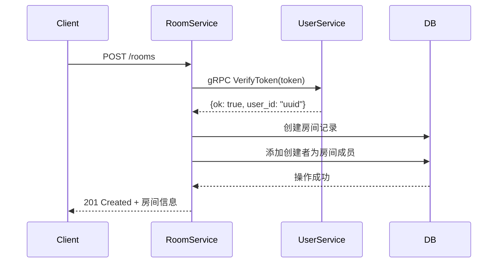

# 1、核心功能模块
- 房间管理：创建、查询、删除房间
- 成员管理：加入/离开房间，获取成员列表
- 消息管理：实时消息传输、历史消息查询
- 权限控制：房间访问权限验证
- 实时通信：WebSocket连接管理、消息广播

# 2、流程图

```mermaid
sequenceDiagram
    participant Client
    participant RoomService
    participant UserService
    participant DB
    
    Client->>RoomService: POST /rooms
    RoomService->>UserService: gRPC VerifyToken(token)
    UserService-->>RoomService: {ok: true, user_id: "uuid"}
    RoomService->>DB: 创建房间记录
    RoomService->>DB: 添加创建者为房间成员
    DB-->>RoomService: 操作成功
    RoomService-->>Client: 201 Created + 房间信息
```

