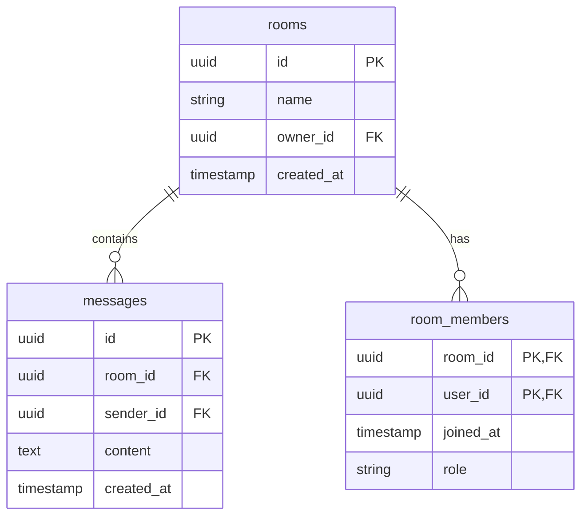

# 1、表结构
**rooms表**
|字段名|类型|约束|描述|
|--|--|--|--|
|id|UUID|PRIMARY KEY|房间唯一标识
|name|VARCHAR(100)|NOT NULL|房间名称
|owner_id|UUID|NOT NULL, FOREIGN KEY|房间创建者ID
|created_at|TIMESTAMP|DEFAULT NOW()|创建时间|

**messages表**
|字段名|类型|约束|描述|
|--|--|--|--|
|id|UUID|PRIMARY KEY|消息唯一标识
|room_id|UUID|NOT NULL, FOREIGN KEY, INDEX|所属房间ID
|sender_id|UUID|NOT NULL, FOREIGN KEY|发送者ID
|content|TEXT|NOT NULL|消息内容
|created_at|TIMESTAMP|INDEX|发送时间

**room_members表**
|字段名|类型|约束|描述|
|--|--|--|--|
|room_id|UUID|PRIMARY KEY, FOREIGN KEY|房间ID
|user_id|UUID|PRIMARY KEY, FOREIGN KEY|用户ID
|joined_at|TIMESTAMP|DEFAULT NOW()|加入时间
|role|VARCHAR(20)|DEFAULT 'member'|用户角色
# ER图
